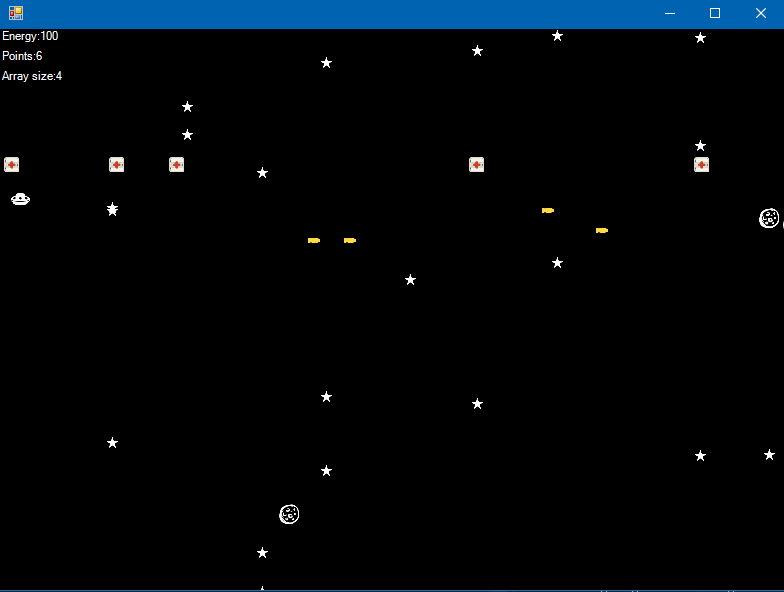
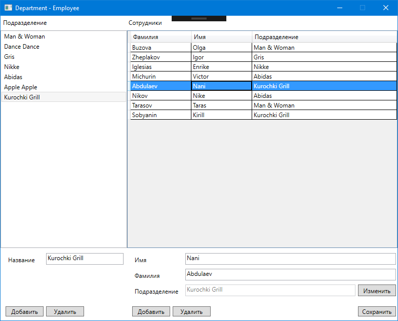
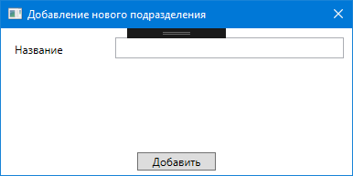
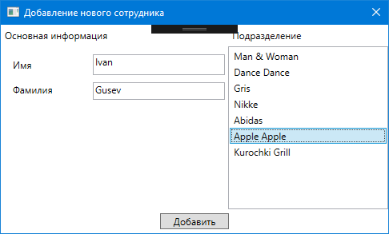
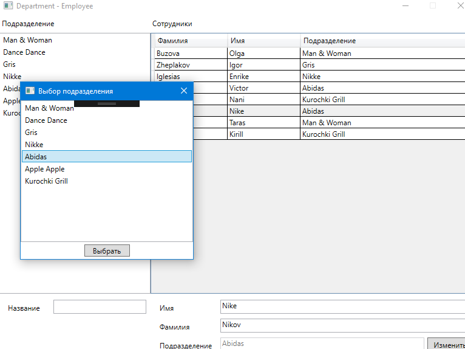
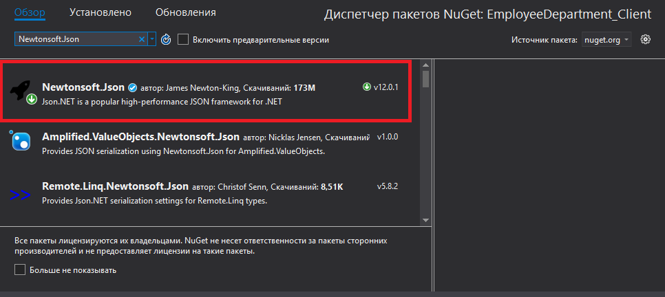

# Решение SharpLevel2
Домашние задания "Продвинутый курс C#"

## Проект SharpLesson1
Простая игра на WinForms. Задача: уничтожить все астероиды. Когда астероиды заканчиваются, генерируется новый пул астероидов размером = предыдущее количество + 1. При попадании астероида по кораблю тратится его здоровье. Здоровье можно восстанавливать аптечками.

Управление:
  - Перемещение вверх/вниз - стрелочки
  - Стрельба - клавиша "A"

## Проект EmployeeWPF
Простое WPF приложение для учёта сотрудников и подразделений. Данные хранятся в локальной MS SQL БД.

Можно добавлять новое подразделение (кнопка "Добавить"). При этом выскочит окно создания новой сущности Department.

Окно добавление нового сотрудника.

Изменение подразделения у сотрудника.

По нажатию кнопки "Сохранить" все изменения из интерфейса переносятся в БД. События удалить, вставить и обновить подразделение у сотрудника сразу же пишутся в БД. Основная логика находится в классе Model.DataController - здесь происходит взаимодействие с БД. Классы, описывающие окна приложения, взаимодействуют с методами Model.DataController (например, UpdateRecord, InsertRecord и т.д.).

### Инструкция по запуску проекта
1. Создать локальную БД
+ имя сервера: (localdb)\MSSQLLocalDB
+ название БД: mydb
2. Запустить приложение, оно автоматом сгенерирует нужные таблицы и заполнит их тестовыми данными

## Проекты EmployeeDepartment_Client и EmployeeDepartment_WS
Это по факту проект EmployeeWPF только разбитый на два - клиентское приложение EmployeeDepartment_Client и веб-сервис (WebAPI) EmployeeDepartment_WS. Клиентское приложение не имеет доступа к БД. Оно получает данные от веб-сервиса, который может читать данные БД, а также их обрабатывать (удалять, обновлять, добавлять). EmployeeDepartment_Client обращается к EmployeeDepartment_WS с помощью GET и POST запросов (формат передаваемых данных - JSON).

Точкой входа для веб-сервиса является класс Controllers.DataController, который принимает запросы от клиента и вызывает необходимые методы класса Model.DataModels.

По функциональным возможностям клиентского приложения подробнее см. описание проекта EmployeeWPF.

### Инструкция по запуску проектов
#### На стороне веб-сервиса
1. Создать БД
+ имя сервера: (localdb)\MSSQLLocalDB
+ название БД: mydb

#### На стороне клиента
1. В App.config проекта "EmployeeDepartment_Client" в строчке appSettings для BaseAddress в value прописать адрес веб-сервиса (по факту просто поменять порт)
2. Из NuGet поставить библиотеку Newtonsoft.Json для клиентского приложения

